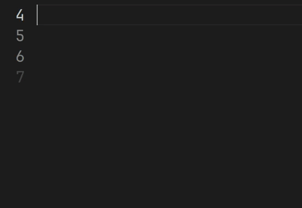

# SAMT

The SAMT extension adds language support for SAMT, the [Simple API Modeling Toolkit](https://github.com/samtkit/core), to Visual Studio Code.

New to SAMT? Check out the [Getting Started Guide](https://github.com/samtkit/core/wiki/Getting-Started) on GitHub.

## Features

At the moment, this extension provides the following features:

### Syntax Highlighting

### Snippets

## Contributing

Want to report a bug, contribute code, or improve documentation? Excellent!
Simply create an [issue](https://github.com/samtkit/vscode/issues),
open a [pull request](https://github.com/samtkit/vscode/pulls) or
start a [discussion](https://github.com/samtkit/vscode/discussions).

More details about the technical implementation of this extension can be found in the [GitHub wiki](https://github.com/samtkit/vscode/wiki).
